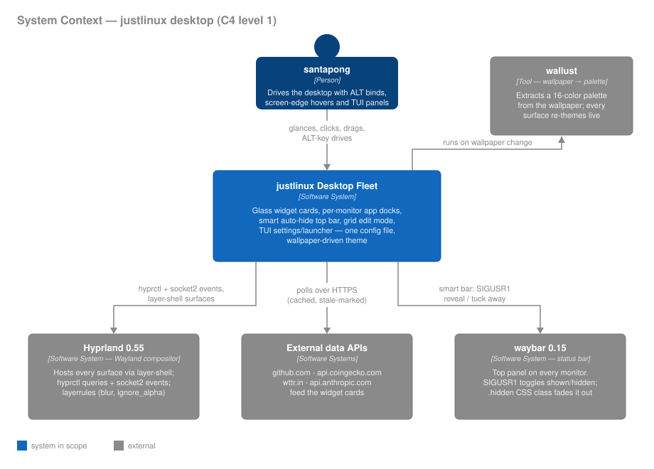
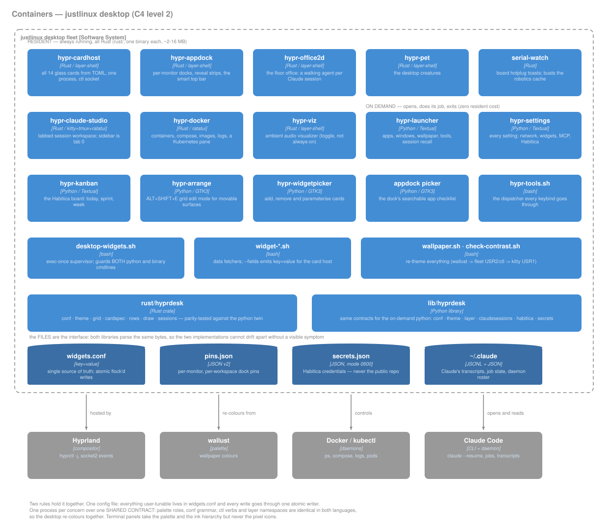
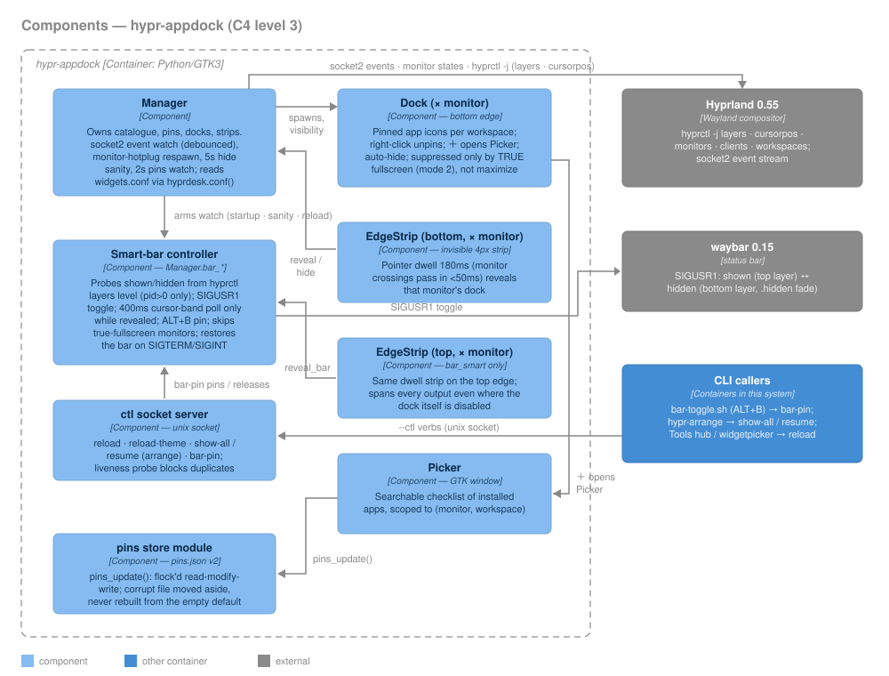
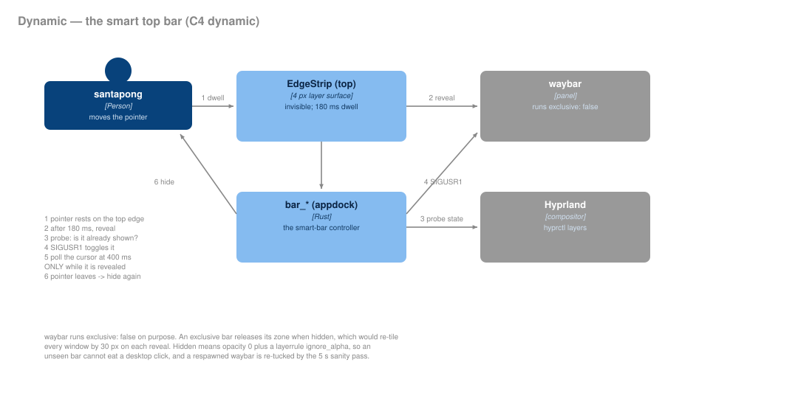

# Architecture

How the justlinux desktop fleet is put together, told with [C4 model](https://c4model.com)
diagrams (Context → Containers → Components → Dynamic). The diagrams are
hand-authored SVGs in [`docs/diagrams/`](diagrams/) — self-colored, so they
render correctly on both light and dark GitHub themes.

> Keep in sync: this page tracks `bin/hypr-appdock`, `bin/hypr-cardhost`,
> `lib/hyprdesk/`, `config/conky/widgets.conf` keys, and the waybar
> smart-bar wiring. If you change how those talk to each other, update the
> matching diagram here.

## Level 1 — System Context

One person, one software system, four things it leans on:

- **Hyprland 0.55** hosts every fleet surface as a layer-shell window and is
  queried (`hyprctl -j`) and watched (socket2 event stream) constantly.
- **waybar** is deliberately *outside* the system: the fleet does not draw
  the top panel, it *drives* it (see the Dynamic diagram).
- **wallust** turns the current wallpaper into a 16-color palette; every
  surface — cards, docks, TUI panels, waybar CSS, Hyprland borders —
  re-themes from it live.
- **External data APIs** (github.com, api.coingecko.com, wttr.in,
  api.anthropic.com) feed the widget cards, with caching and explicit
  stale-rendering when a poll fails.

## Level 2 — Containers

| Container | Tech | Responsibility |
|---|---|---|
| `hypr-cardhost` | Python/GTK3 | Renders all 14 glass widget cards from TOML templates in **one process** |
| `hypr-appdock` | Python/GTK3 | Per-monitor bottom docks **and the smart top bar** (see Level 3) |
| `hypr-arrange` | Python/GTK3 | ALT+SHIFT+E grid edit mode for card placement |
| `hypr-widgetpicker` | Python/GTK3 | Card gallery: add / remove / parameterize instances |
| `hypr-settings` · `hypr-launcher` | Textual TUI | Control panels in a glass kitty float |
| `hypr-tools.sh` | bash | Dispatcher glue: every panel action, smart-bar toggle, reminders |
| `desktop-widgets.sh` | bash | `exec-once` supervisor: spawns and restarts the fleet at login |
| `widget-*.sh` | bash | Data fetchers; `--fields` emits `key=value` for the card host |
| `lib/hyprdesk` | Python library | Shared: conf, theme, layer-shell (ctypes), grid, row renderers, atomic config writer |
| `widgets.conf` | key=value file | **Single source of truth** for every setting; all writes go through `hyprdesk.confwrite` (flock, atomic) |
| `pins.json` | JSON v2 | Per-monitor, per-workspace dock pins; flock'd read-modify-write |

Two architectural rules hold the fleet together:

1. **One config file.** Everything user-tunable lives in `widgets.conf`
   (`~/.config/conky/widgets.conf` — legacy path, not conky-specific).
   Editors write through one atomic writer; hosts re-read on `--ctl reload`.
2. **One process per concern, one library underneath.** Every GTK surface is
   built on `hyprdesk.layer.LayerWindow` (ctypes gtk-layer-shell) and themed
   by `hyprdesk.theme`, so the whole desktop re-colors and re-layouts
   consistently.

## Level 3 — Components: `hypr-appdock`

The dock process is the fleet's edge-interaction hub — docks at the bottom
of each monitor, and since `bar_smart=on`, the **smart top bar** too:

- **Manager** owns everything: spawns docks/strips per monitor, watches the
  socket2 event stream (debounced), respawns on monitor hotplug, runs a 5s
  hide-sanity pass and a 2s pins-file watch.
- **EdgeStrip** is an invisible 4px strip on a screen edge. A 180ms dwell
  separates "resting a pointer on the edge" from "crossing between stacked
  monitors" (a crossing transits in under 50ms).
- **Smart-bar controller** (`Manager.bar_*`) drives waybar — a *foreign*
  surface, so there are no GTK crossing events for it. It probes
  shown/hidden from `hyprctl layers` (level ≥ 2 = shown, `pid > 0` entries
  only), toggles with `SIGUSR1`, and polls the cursor against the bar's
  boxes every 400ms **only while the bar is revealed**.
- **ctl socket** takes `reload`, `reload-theme`, `show-all`/`resume`
  (arrange sessions), and `bar-pin` (ALT+B pins the bar open).

## Dynamic — the smart-bar cycle

Design decisions behind it, in one place:

- **waybar runs `"exclusive": false`.** waybar's hidden state releases its
  exclusive zone, so an exclusive bar would re-tile every window by 30px on
  each reveal. Non-exclusive, the bar overlays transiently and the cards
  gained the 30px band permanently.
- **Hidden = fully invisible + click-through.** `SIGUSR1`-hidden waybar
  carries a `.hidden` CSS class → `opacity: 0` with a 250ms transition
  (the fade), and `layerrule = ignore_alpha 0.2` makes the transparent bar
  click-through so unseen modules can't eat desktop clicks.
- **Never strand the panel.** A respawned waybar comes back visible and is
  re-tucked by the sanity pass; the dock restores the bar on
  SIGTERM/SIGINT; turning `bar_smart` off restores it via `--ctl reload`.
- **Maximize is not fullscreen.** Docks are suppressed only by TRUE
  fullscreen (client mode 2). Double-click-maximize (hyprbars, mode 1)
  keeps every edge surface reachable.
