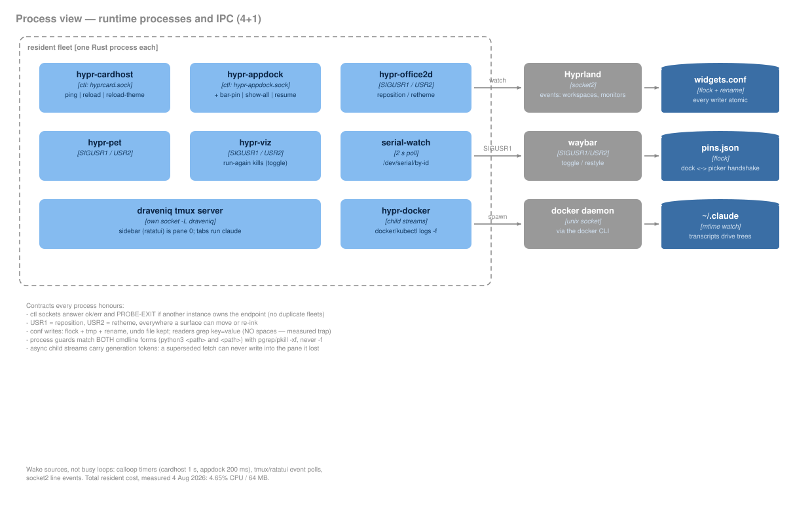
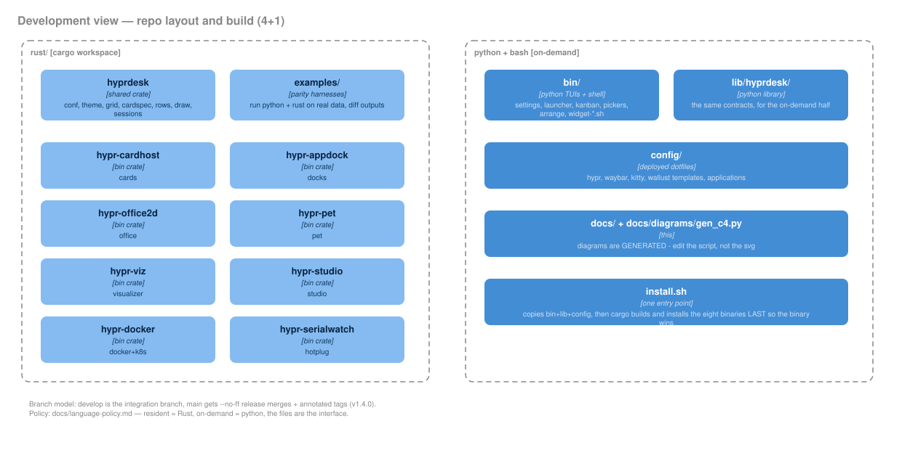
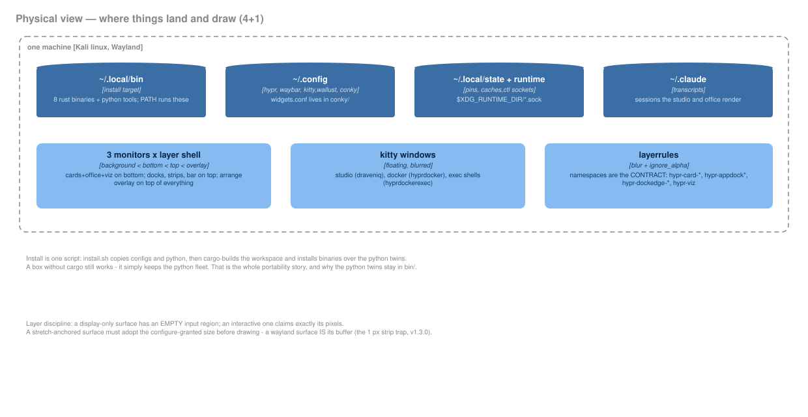
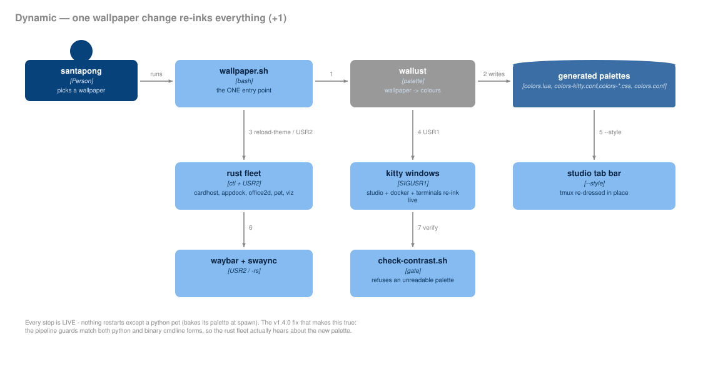

# Architecture

How the justlinux desktop fleet is put together, told with
[C4 model](https://c4model.com) diagrams (Context → Containers →
Components → Dynamic) plus the [4+1 view model](https://en.wikipedia.org/wiki/4%2B1_architectural_view_model)
views that C4 does not cover: what runs (process view), how the repo is
shaped (development view), and where things land on disk and screen
(physical view). Language rules live in
[language-policy.md](language-policy.md) — since v1.4.0 every resident
process is Rust; Python opens on demand and exits.

**Reading order for a newcomer:** context → containers →
process view → the recolor scenario. Everything else is detail.

Every diagram is an SVG in [`docs/diagrams/`](diagrams/), **generated by
[`docs/diagrams/gen_c4.py`](diagrams/gen_c4.py)** — do not hand-edit the
`.svg` files, edit the declarations in that script and re-run it:

```sh
python3 docs/diagrams/gen_c4.py
```

They were hand-authored once, and the cost of hand-editing SVG was high
enough that the diagrams stopped being updated. A box is now four numbers
and three strings. The output uses inline attributes and polygon
arrowheads only — no CSS, no markers, no external fonts — and self-colored
fills, so the same file is legible on GitHub's light *and* dark themes.

| Diagram | Level | Also shown in |
|---|---|---|
| [`c4-context.svg`](diagrams/c4-context.svg) | 1 · Context | [README](../README.md) |
| [`c4-container.svg`](diagrams/c4-container.svg) | 2 · Containers | here |
| [`c4-component-appdock.svg`](diagrams/c4-component-appdock.svg) | 3 · Components | here |
| [`c4-component-studio.svg`](diagrams/c4-component-studio.svg) | 3 · Components | [claude-studio.md](claude-studio.md) |
| [`c4-component-office.svg`](diagrams/c4-component-office.svg) | 3 · Components | [claude-office.md](claude-office.md) |
| [`c4-component-habitica.svg`](diagrams/c4-component-habitica.svg) | 3 · Components | [habitica-board.md](habitica-board.md) |
| [`c4-dynamic-smartbar.svg`](diagrams/c4-dynamic-smartbar.svg) | Dynamic | here |
| [`c4-process-view.svg`](diagrams/c4-process-view.svg) | 4+1 · Process | here |
| [`c4-development-view.svg`](diagrams/c4-development-view.svg) | 4+1 · Development | here |
| [`c4-physical-view.svg`](diagrams/c4-physical-view.svg) | 4+1 · Physical | here |
| [`c4-dynamic-recolor.svg`](diagrams/c4-dynamic-recolor.svg) | Dynamic (+1 scenario) | here |

> Keep in sync: this page tracks `bin/hypr-appdock`, `bin/hypr-cardhost`,
> `lib/hyprdesk/`, `config/conky/widgets.conf` keys, and the waybar
> smart-bar wiring. If you change how those talk to each other, edit
> `gen_c4.py` and re-run it.

## Level 1 — System Context


One person, one software system, four things it leans on:

- **Hyprland 0.55** hosts every fleet surface as a layer-shell window and is
  queried (`hyprctl -j`) and watched (socket2 event stream) constantly.
- **waybar** is deliberately *outside* the system: the fleet does not draw
  the top panel, it *drives* it (see the Dynamic diagram).
- **wallust** turns the current wallpaper into a 16-color palette; every
  surface — cards, docks, TUI panels, waybar CSS, Hyprland borders —
  re-themes from it live.
- **Claude Code** is leaned on, not wrapped: its transcripts under
  `~/.claude/projects`, its job state, its daemon roster and its
  `claude mcp` CLI are read and driven, but the fleet never reimplements
  them.
- **Habitica** (REST v3) backs the board. Two states it does not have —
  "doing" and sprint membership — are stored as *tags*, so the phone and
  the website see them too.
- **External data APIs** (github.com, api.coingecko.com, wttr.in) feed the
  widget cards, with caching and explicit stale-rendering when a poll
  fails.

## Level 2 — Containers


| Container | Tech | Responsibility |
|---|---|---|
| `hypr-cardhost` | Python/GTK3 | Renders all 14 glass widget cards from TOML templates in **one process** |
| `hypr-appdock` | Python/GTK3 | Per-monitor bottom docks **and the smart top bar** (see Level 3) |
| `hypr-arrange` | Python/GTK3 | ALT+SHIFT+E grid edit mode for card placement |
| `hypr-widgetpicker` | Python/GTK3 | Card gallery: add / remove / parameterize instances |
| `hypr-settings` · `hypr-launcher` | Textual TUI | Control panels in a glass kitty float; Settings also holds Habitica keys and the MCP server list |
| `hypr-kanban` | Textual TUI | The Habitica board — today, to-dos, sprint, week, dailies, habits |
| `hypr-claude-studio` | kitty + tmux + Textual | Tabbed Claude session workspace, with splits |
| `hypr-claude-office` | Python/GTK3 | A pixel desk per live Claude session |
| `hypr-tools.sh` | bash | Dispatcher glue: every panel action, smart-bar toggle, reminders |
| `desktop-widgets.sh` | bash | `exec-once` supervisor: spawns and restarts the fleet at login |
| `widget-*.sh` | bash | Data fetchers; `--fields` emits `key=value` for the card host |
| `lib/hyprdesk` | Python library | Shared: conf, theme, layer-shell (ctypes), grid, row renderers, atomic config writer |
| `widgets.conf` | key=value file | **Single source of truth** for every setting; all writes go through `hyprdesk.confwrite` (flock, atomic) |
| `pins.json` | JSON v2 | Per-monitor, per-workspace dock pins; flock'd read-modify-write |
| `secrets.json` | JSON, mode 0600 | Credentials, outside the repo — validated against their API before being stored |

Two architectural rules hold the fleet together:

1. **One config file.** Everything user-tunable lives in `widgets.conf`
   (`~/.config/conky/widgets.conf` — legacy path, not conky-specific).
   Editors write through one atomic writer; hosts re-read on `--ctl reload`.
2. **One process per concern, one library underneath.** Every GTK surface is
   built on `hyprdesk.layer.LayerWindow` (ctypes gtk-layer-shell) and themed
   by `hyprdesk.theme`, so the whole desktop re-colors and re-layouts
   consistently.

## Level 3 — Components

Four containers are complex enough to be worth their own component
diagram. One is below; the other three live with the docs for the thing
they describe:

- **[Claude Studio](claude-studio.md)** — tabs, splits, and why the
  sidebar cannot be cut in half.
- **[The 2D office](claude-office.md)** — how a desk is bound to a
  conversation.
- **[The Habitica board](habitica-board.md)** — the tag trick, and the
  request budget behind it.

### `hypr-appdock`


The dock process is the fleet's edge-interaction hub — docks at the bottom
of each monitor, and since `bar_smart=on`, the **smart top bar** too:

- **Manager** owns everything: spawns docks/strips per monitor, watches the
  socket2 event stream (debounced), respawns on monitor hotplug, runs a 5s
  hide-sanity pass and a 2s pins-file watch.
- **EdgeStrip** is an invisible 4px strip on a screen edge. A 180ms dwell
  separates "resting a pointer on the edge" from "crossing between stacked
  monitors" (a crossing transits in under 50ms).
- **Smart-bar controller** (`Manager.bar_*`) drives waybar — a *foreign*
  surface, so there are no GTK crossing events for it. It probes
  shown/hidden from `hyprctl layers` (level ≥ 2 = shown, `pid > 0` entries
  only), toggles with `SIGUSR1`, and polls the cursor against the bar's
  boxes every 400ms **only while the bar is revealed**.
- **ctl socket** takes `reload`, `reload-theme`, `show-all`/`resume`
  (arrange sessions), and `bar-pin` (ALT+B pins the bar open).

## Dynamic — the smart-bar cycle


Design decisions behind it, in one place:

- **waybar runs `"exclusive": false`.** waybar's hidden state releases its
  exclusive zone, so an exclusive bar would re-tile every window by 30px on
  each reveal. Non-exclusive, the bar overlays transiently and the cards
  gained the 30px band permanently.
- **Hidden = fully invisible + click-through.** `SIGUSR1`-hidden waybar
  carries a `.hidden` CSS class → `opacity: 0` with a 250ms transition
  (the fade), and `layerrule = ignore_alpha 0.2` makes the transparent bar
  click-through so unseen modules can't eat desktop clicks.
- **Never strand the panel.** A respawned waybar comes back visible and is
  re-tucked by the sanity pass; the dock restores the bar on
  SIGTERM/SIGINT; turning `bar_smart` off restores it via `--ctl reload`.
- **Maximize is not fullscreen.** Docks are suppressed only by TRUE
  fullscreen (client mode 2). Double-click-maximize (hyprbars, mode 1)
  keeps every edge surface reachable.

## 4+1 — Process view



Every resident process, and every IPC edge between them: the two ctl
sockets, the USR1/USR2 signal contract, the socket2 event stream, the
flock'd files. Read this before touching a socket, a signal or the
conf file — the notes on it are the invariants the fleet holds.

## 4+1 — Development view



One cargo workspace (a shared `hyprdesk` crate, eight bin crates, the
parity harnesses in `examples/`) beside the on-demand Python and the
deployed dotfiles. `install.sh` is the single entry point and installs
binaries last, so a machine without cargo still gets the Python fleet.

## 4+1 — Physical view



Where things land (`~/.local/bin`, `~/.config`, runtime sockets) and
where they draw (which layer each surface lives on, which kitty window
classes float, which layerrule namespaces are contractual).

## Dynamic — one wallpaper change re-inks everything



The +1 scenario that exercises every view at once: `wallpaper.sh` runs
wallust, the generated palettes fan out, and every surface — rust
fleet, kitty windows, the studio tab bar, waybar — re-inks live. The
contrast gate can refuse a palette that would be unreadable.
