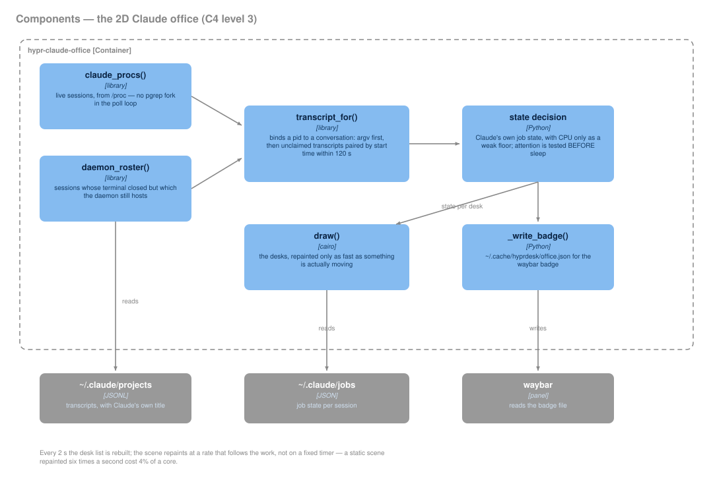

# Claude Office

A layer-shell scene that draws **one desk per live Claude session**, so a glance
answers the only question that matters while agents are working: *does anything
need me?*

`bin/hypr-claude-office` · namespace `hypr-office` · **ALT+CTRL+O** toggles ·
autostarts when `claude_office=on` in `widgets.conf`.

> Keep in sync: this page tracks `bin/hypr-claude-office`,
> `lib/hyprdesk/claudesessions.py`, `bin/widget-claude.sh` and the
> `office_*` keys in `config/conky/widgets.conf`.

## Where its facts come from

The office invents nothing — it reads five sources, and degrades to the next
one whenever a read fails. Two of them are **undocumented Claude Code
internals** whose shape has already drifted across CLI versions, so every
access is wrapped: an upgrade must make the office *dumber*, never broken.

| Source | Gives | Note |
|---|---|---|
| `pgrep -x claude` → `/proc` | live sessions, cwd, tty | skips Claude's own daemon + `bg-pty-host` plumbing |
| `~/.claude/daemon/roster.json` | daemon-hosted sessions | mode 0600; unreadable is a *normal* outcome |
| `~/.claude/projects/**/*.jsonl` | transcript, name, activity | the `aiTitle` entry is Claude's own name for the conversation |
| `~/.claude/jobs/<sid>/state.json` | `state` + a human `detail` | terminal states go stale — see freshness rule below |
| `hyprctl -j clients` | the window to focus on click | |

## The poll loop

Every **2 s** (`POLL_S`) the desk list is rebuilt; the scene repaints every
160 ms for animation.



*Generated by [`docs/diagrams/gen_c4.py`](diagrams/gen_c4.py) — edit the
declaration there, not the SVG.*

### What counts as a session

`claude` is one binary for a conversation *and* for a pile of one-shot
subcommands — `mcp`, `update`, `doctor`, `plugin`, `auth`. A session is
`claude` with **no subcommand**; anything else is a CLI call that happens
to share the name, and is skipped.

This matters because `claude mcp list` health-checks every server over the
network and runs for ~20 s. Opening Hypr Settings, which lists MCP
servers, used to paint a phantom desk in the office and a phantom
background job in every picker for as long as it took.

Claude Code's own plumbing — the supervisor and its `bg-pty-host` /
`--bg-spare` workers — is skipped the same way: the daemon is always
alive, so listing it painted an everlasting phantom.

### Binding a desk to a conversation

Getting this wrong shows you the wrong session's name, so it is done by
evidence, not by guessing:

1. **`/proc/<pid>/cmdline`** — if the process was started with `--resume` or
   `--session-id`, that *is* the answer.
2. Otherwise pair by **time**: among unclaimed transcripts in the same cwd,
   take the one whose first timestamp is closest to the process start,
   **bounded at 120 s**. Past that the desk stays unbound and retries next
   poll — waiting beats adopting a sibling session's transcript.

A binding, once correct, is kept for the life of the process.

## How a desk picks its state

In priority order:

1. **Claude's own job state wins** — `blocked → needs you`, `working`,
   `done → idle`, `stopped → asleep`. For an *interactive* session this is
   only trusted while `state.json` is **under 60 s old**; every file on this
   machine is days old and terminal, and a stale `done` froze a resumed desk
   forever. Daemon-hosted desks trust it at any age — their pid is the
   pty-host, so there is no CPU or window signal to fall back on.
2. **Transcript freshness** — grew within 3 s → `working`; within 8 s →
   `reading`.
3. **"Needs you" is a positive claim**, not a timeout: the tail of the
   transcript is read (last 16 KB), bookkeeping entries are skipped, and it
   fires only when the last *meaningful* record is Claude finishing a turn or
   requesting permission. **It is tested before the sleep timer** — testing
   sleep first made attention a 112-second window that a fresh desk could
   never enter, and the count was permanently zero.
4. Otherwise `idle`, or `asleep` after 120 s.

> **CPU is deliberately almost irrelevant.** `BUSY_TICKS` is 120 because
> measurement on this machine showed *idle* sessions burning 15–43 ticks per
> 2 s poll while a working one sat in the same band. CPU cannot tell them
> apart, so it is only a coarse backstop.

## What a desk shows

- **Name** — Claude's `aiTitle`, wrapped over two lines. Daemon desks prefer
  the job's own name; the directory is the last resort. (Before this, every
  session in `$HOME` read `~`.)
- **State as a word** plus a colour dot — `working`, `reading`, `needs you`,
  `idle`, `asleep`. A dot alone made you decode a colour from memory.
- A desk that needs you gets a **tinted plate** and its name in `accent2`.
- **Workflow subagents** hop beside their parent desk with a `×N` count.
- **Hover** fills the bottom strip with the full title, directory and
  Claude's `detail` line.
- Capped at `office_cols × 2` desks; the remainder collapses into `+N more`.

## Clicking

The whole card takes clicks. **A desk opens its session; anywhere else opens
the Studio** — the header, the gaps between desks, the `+N more` marker, and
the empty office (which shows a sleeping Clawd when nothing is running). The
office is a *view*; the Studio is where you work.

Clicking a desk:

```
window address?  ──yes──▶ focus that window
      │no
studio tab (matched by tty)? ──yes──▶ select that tab
      │no
process still alive? ──yes──▶ notify only
      │no
has a session id? ──yes──▶ reopen it (studio tab, else kitty)
```

A **live** session is never resumed. `claude --resume` on a running
conversation starts a *second* process against one transcript.

## Many sessions at once

Desks wrap at `office_cols` and stop after two rows; the last slot then becomes
`+N more`, which opens the Studio.

Two rules keep that readable:

- **Desks hold pid order** so they don't shuffle under your cursor as states
  change.
- **Slots are allocated by urgency** — `needs you` → `working` → `reading` →
  `idle` → `asleep`. A session waiting on you is never the one folded into
  `+N more`.

The column count is also clamped to what the monitor can actually hold, so a
hand-edited `office_cols` cannot push the card off the side of the screen.

## Configuration

All in `config/conky/widgets.conf`:

| Key | Default | Meaning |
|---|---|---|
| `claude_office` | `on` | autostart with the fleet |
| `office_mon` | `DP-1` | which monitor it lives on |
| `office_layer` | `bottom` | `bottom` = desktop widget (windows cover it), `top` = floats over your work |
| `office_ws` | *unset* | pin to ONE workspace; unset = every workspace |
| `office_cols` | `5` | desks per row before wrapping (clamped to what the monitor fits) |
| `office_pos` / `_x` / `_y` | `bottom_left` 24,24 | placement, written by grid edit mode |

### Does it respect the grid?

Yes — in **GRID** mode. `hypr-arrange` used to decide placement by *kind*:
cards always snapped, everything else never did. Since the two-mode editor,
the mode decides, and in GRID mode the office snaps to the same cell lattice
the cards use.

The remaining difference is **storage, not snapping**. A card stores
`_col/_row`, so it re-flows when the resolution or grid density changes. The
office stores the resulting pixels as `office_pos/_x/_y`, because
`LayerWindow` — which every non-card surface is built on — has no concept of
cells. So it *lands* on the grid but does not *follow* the grid afterwards.

Making it a true cell citizen would mean re-implementing the placement engine
that lives inside `hypr-cardhost` in every standalone widget, and the office's
width changes with the session count, so a stored cell span would go stale on
the next poll.

### Moving it

Drag it in **ALT+SHIFT+E** (`g` switches grid/free snap). On save:

- a move **within** a monitor sends **SIGUSR1** — it re-reads the config and
  moves live, no restart, no flicker;
- a move **across** monitors **restarts** it, because a layer surface is bound
  to its output when it maps and `set_target_monitor()` is pre-show-only.

**SIGUSR2** reloads the palette after a wallpaper change.

> Both signals are set to `SIG_IGN` at import, *before* the window is built.
> `SIGUSR1`'s default disposition is **terminate**, so a reload signal
> arriving during startup would otherwise kill the widget it was meant to
> move. The trade-off: a signal sent during startup is discarded, so the very
> first move after launch can be a no-op.

### `office_ws` and workspaces

A layer surface has no workspace of its own — it belongs to a *monitor* and
rides above or below every workspace on it. So "only on workspace 3" can only
mean **hiding it when you leave**, which is what `office_ws` does, driven by
Hyprland's event socket. Note it compares against the workspace active on the
office's **own monitor**, not the globally focused one.

Because a hidden Wayland window drops its `wl_surface`, a pinned office would
vanish from `hyprctl layers` — and therefore from grid edit mode. It force-shows
itself whenever `hypr-arrange` is running.

## The waybar badge

Each poll atomically writes `~/.cache/hyprdesk/office.json`
(`{needy, total, blocked, text, tooltip}`); `bin/widget-claude.sh` renders it as
a waybar module so the count reaches every monitor. It prints **empty** when the
file is missing, stale (>120 s), malformed, or nothing is waiting — the badge
appears only when there is a real reason to look. It is deleted on exit, so it
cannot outlive the office, and its click target is `--show` (non-toggling), not
the bare command, which would *close* the office you just clicked to see.

## Related

- [`architecture.md`](architecture.md) — the fleet as a whole
- `bin/hypr-claude-studio` — tabbed session workspace (**ALT+CTRL+U**)
- `lib/hyprdesk/claudesessions.py` — shared session discovery
