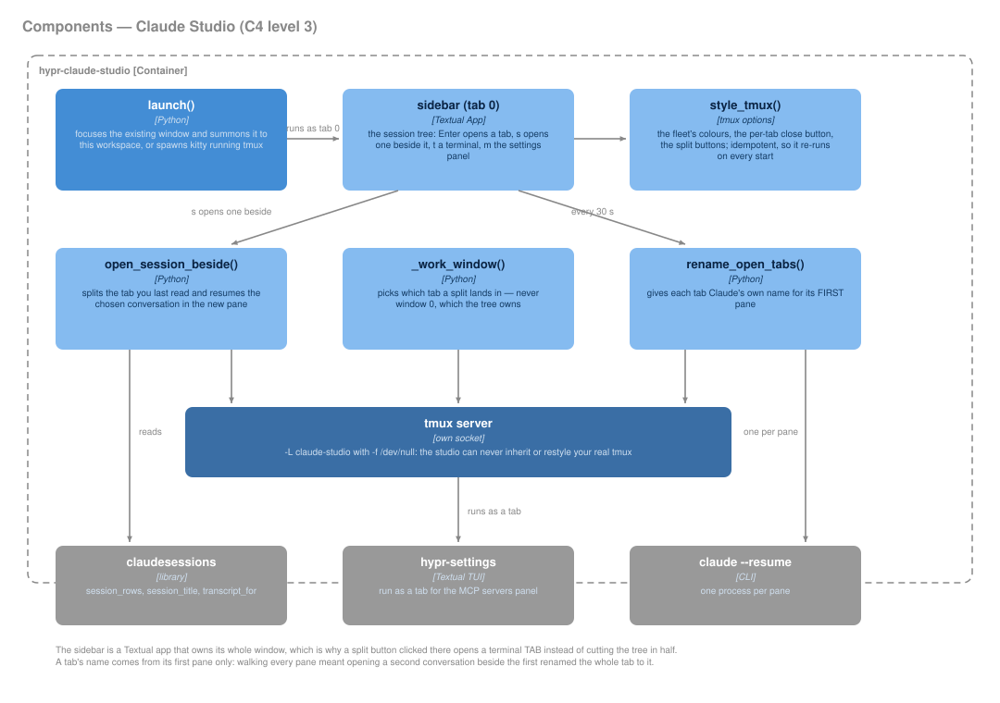

# DravenIQ Meta Harness (formerly Claude Studio)

`ALT+CTRL+U` — one window that holds every Claude Code conversation, the
way an editor holds every open file.

It is not a new application. It is **one kitty window running one tmux
session** on its own socket (`tmux -L claude-studio`, started with
`-f /dev/null`), so it can never inherit or restyle the real tmux server
you use for work — no plugins, no resurrect, no theme collision.



*Generated by [`docs/diagrams/gen_c4.py`](diagrams/gen_c4.py) — edit the
declaration there, not the SVG.*

```
┌─ row 0 ──────────────────────────────────────────────────────────┐
│ 󰚩 DravenIQ            dots · 4 tabs · [zoom]      / │ ─  studio   │
├─ row 1 — the tabs ───────────────────────────────────────────────┤
│  0 sessions   1 fix-the-parser +api ✕   2 talos ○ ✕   3 aegis ● ✕│
├──────────────────────────────────────────────────────────────────┤
│  the selected tab's window — one pane, or several                │
└──────────────────────────────────────────────────────────────────┘
```

Row 0 brands the studio and says where you are: the focused pane's
directory, the TRUE tab count (row 1 clips at the right edge — see the
jump palette below for why there is no scrollport), and `[zoom]` / the
copy-mode name when a pane state changes what your keys do. The `/` and
split buttons are fg-on-muted blocks: **accent means exactly one thing in
this bar — "you are here"** — and nothing else is allowed to wear it.

## Tab 0 — the session tree

Tab 0 is a Textual app (`--sidebar`), and it is the only tab without a ✕:
closing it would take the sidebar with it.

| Key | Does |
|---|---|
| `Enter` | Open the highlighted conversation as its own tab |
| `s` | Open it **beside** the one you are reading — two conversations, one screen |
| `n` | New Claude session in the highlighted project's directory |
| `N` | New **Codex** session there (see *Two agents* below) |
| `t` | Plain terminal tab there — for the git/build/log half of the work |
| `m` | The settings panel (MCP servers) as a tab |
| `x` | Stop a 󰑮 background session (its transcript stays resumable) |
| `r` | Refresh the tree |
| `q` | Close the whole studio — **after a dialog** that names every tab and live conversation it would take. `q`, `Esc` and `Enter` all cancel; killing needs `Tab`+`Enter` or a click. An empty studio skips the question. |

**Mouse: first click aims, second click opens.** The stock Tree selects on
any single click, and selecting a session here means `claude --resume` —
on one-cell rows, missing by one row didn't highlight the wrong
conversation, it *opened* it. Now the first click only moves the cursor
bar (accent, 55%, bold — visible from across the room), and clicking the
row that already wears it commits. A fast double-click still opens;
`Enter` still opens in one press, because a keyboard cannot misaim; and
projects still expand on the first click, because a mistoggle is free.

The tree refreshes itself every 6 s, because it goes stale the moment a
tab is closed or a session starts somewhere else — but only redraws when
something actually changed. It used to rebuild unconditionally, which
collapsed whatever project you had opened and threw the cursor back to
the top, every six seconds. When it does change, expanded projects and
the cursor are put back. Every 30 s it also
re-names open tabs: Claude titles a conversation a little *after* it
starts, so a tab opened from the tree gets its real name on a later pass.

**Opening something already open focuses its tab** rather than starting a
second `claude --resume` against the same conversation.

A running session started *inside* the studio has no Hyprland window of
its own — the parent chain dead-ends at the tmux server — so selecting it
matches its tty against the studio's panes and focuses that tab instead.

## Two agents — Claude and Codex

The tree is agent-agnostic. Claude conversations come from
`~/.claude/projects/**/*.jsonl`; Codex conversations from
`~/.codex/sessions/YYYY/MM/DD/rollout-<ts>-<uuid>.jsonl`, whose first line
(`session_meta`) carries the cwd and whose first `role: user` message is
the preview (Codex has no `aiTitle`, so that preview is also the tab
name). Codex rows and tabs wear 󰚩 (nf-md-robot — it passes the
JetBrainsMono NF glyph gate; ✦ does not). Both kinds group under the same
project folder.

| Action | Claude | Codex |
|---|---|---|
| open / beside | `claude --resume <sid>` | `codex resume <sid>` |
| new (`n` / `N`) | `claude --session-id <uuid>` — identity from birth | `codex` — no such flag; identity arrives once the process holds its rollout open (`/proc/<pid>/fd`), picked up by the 30 s rename pass |
| running detection | `/proc` + argv/cwd/time heuristics | `/proc/<pid>/fd` → rollout → sid, a fact |

## Multi-line input — Shift+Enter

Both CLIs take Shift+Enter as *newline* when the terminal speaks the kitty
keyboard protocol; kitty does. Inside the studio that protocol has to cross
tmux, and a server started with `-f /dev/null` has `extended-keys off`, so
Shift+Enter collapsed to a bare CR and **submitted**. The studio now sets
`extended-keys always`, `extended-keys-format csi-u` and
`terminal-features xterm-kitty:extkeys` (server options — they apply to a
running studio too). `on` was tried first and was not enough: tmux then
forwards extended keys only to a pane whose application asked for them,
tracked per pane, so a tab started before the setting landed kept
submitting. `always` forwards to every pane; the one side effect is that a
plain terminal tab shows `^[[13;2u` when you press Shift+Enter — harmless,
and `bindkey -s '^[[13;2u' '^M'` in `.zshrc` maps it back to Enter if it
bothers you. Fallbacks that never depend on the terminal:
`\` then `Enter` in Claude, `Ctrl+J` in Codex.

## Tabs

One conversation per tab, named from **Claude's own title** for it, not
the directory. Before that, every session in `$HOME` opened a tab called
`santapong` and the close buttons were a guessing game.

- **✕** on a tab closes it. Middle-click anywhere on the tab does the same.
- **`○` and `●` are the attention marks**, from tmux's own alert flags —
  `○` (sub ink) is output you have not looked at, `●` (good ink) is a bell:
  Claude finished its turn and wants you. Selecting the tab is what clears
  them, because that is already what tmux does with the flags.
- A split tab **names its second conversation** — `+api` instead of `·2`.
  The bare `·N` count remains for when the other pane is just a shell.
  `@beside` is re-derived every rename pass, so killing the identity pane
  renames the tab to the conversation still running.
- A **new** session gets its id from the studio (`claude --session-id`),
  so three `n` presses in one project no longer make three identical tabs
  forever — each upgrades to Claude's title on the next pass.
- Closing a tab ends the *terminal*, not the conversation — it is still in
  the tree, still resumable.

tmux has no per-glyph hit testing, so the ✕ carries its own `range=user|`
tag (wrapping its padding: 3–4 clickable cells, not one), and every tab
carries `range=window|` — the region `select-window -t=` and
`kill-window -t=` both resolve against. Dropping that tag once broke
left-click entirely and made middle-click kill the *current* tab.

## Jump anywhere — `C-b g`

`C-b g` (or `C-b C-Space`, or the `/` button in row 0) opens a fuzzy
popup over **every open tab and every resumable transcript** — pick a tab
and it selects it, pick a transcript and it opens as one. Live sessions
are deliberately absent: handing one to `claude --resume` would open a
second client on a running conversation.

It is also the answer to tab overflow. Row 1 has **no scrollport on
purpose**: on tmux 3.7b, `list=on` desyncs the mouse hit table the moment
the list trims — a click on one tab's label killed a different window —
so tabs past the right edge have no mouse path at all. This is how you
reach them. Degrades to `choose-tree -Z` if fzf is ever missing.

## Splits — several panes in one tab

A conversation usually wants something beside it: the test run, the log,
a shell in the same repo.

| | |
|---|---|
| `C-b \|` | split side by side |
| `C-b -` | split stacked |
| `[\|]` `[-]` in the tab bar | the same two, by mouse |
| `C-b ←↑↓→` | move between panes |
| `C-b z` | zoom one pane full-screen, and back |
| mouse | click a pane to focus it, drag a border to resize |

Splits inherit the current pane's directory, so a split next to a session
lands in that session's repo.

**`s` in the tree is the one you want for two conversations at once.** A
bare split gives you a shell; `s` splits the tab you were last reading and
runs `claude --resume` in the new pane, so the two sit side by side. If
that conversation is already open it focuses its tab instead — a second
`claude --resume` on one conversation is the duplicate the tab path
already refuses. With nothing but the tree open there is nothing to sit
beside, so it opens a tab.

**The pane title line only appears once a window actually has two panes.**
A `window-layout-changed` hook turns `pane-border-status` on and off, so a
single-pane tab loses no rows. (`pane-exited` was tried first — it does not
fire for `kill-pane`.)

**The split buttons never cut the sidebar in half.** Clicking `[|]` while
tab 0 is selected opens a terminal *tab* instead: the tree is a Textual app
that owns its whole window. That decision lives in `--split`, which the
tab-bar buttons route through.

## Why MCP settings are not a Studio feature

The studio has no settings framework — it is a tmux session whose tab 0
happens to run a Textual tree. Hypr Settings is the one with the sidebar,
the panes and the `Card` class. Building a second settings surface inside
the studio would mean maintaining two.

But a studio tab is just a tmux window, and Hypr Settings is a terminal
app like the sidebar — so `m` runs `hypr-settings integrations` as a tab.
Same panel, same code, reachable without leaving the studio.

## Theme

`style_tmux()` is idempotent and re-runs on every sidebar start, so a
wallpaper change reaches the tab bar. Colour comes from `hyprdesk.colors()`
— never waybar's raw wallust slots. The ink hierarchy is the fleet's:
`accent2` titles the bar, `accent` marks the selected tab and the active
pane border, `sub` for everything at rest.

Terminal panels get the palette and the ink hierarchy but never the pixel
icons — tmux draws characters, not sprites.

## Files

| | |
|---|---|
| `bin/hypr-claude-studio` | all of it — `launch`, `--sidebar`, `--split`, `--palette` |
| `lib/hyprdesk/claudesessions.py` | where sessions and their titles come from |

Launching when the studio already exists **summons** it to the current
workspace rather than yanking you to wherever it was left.
