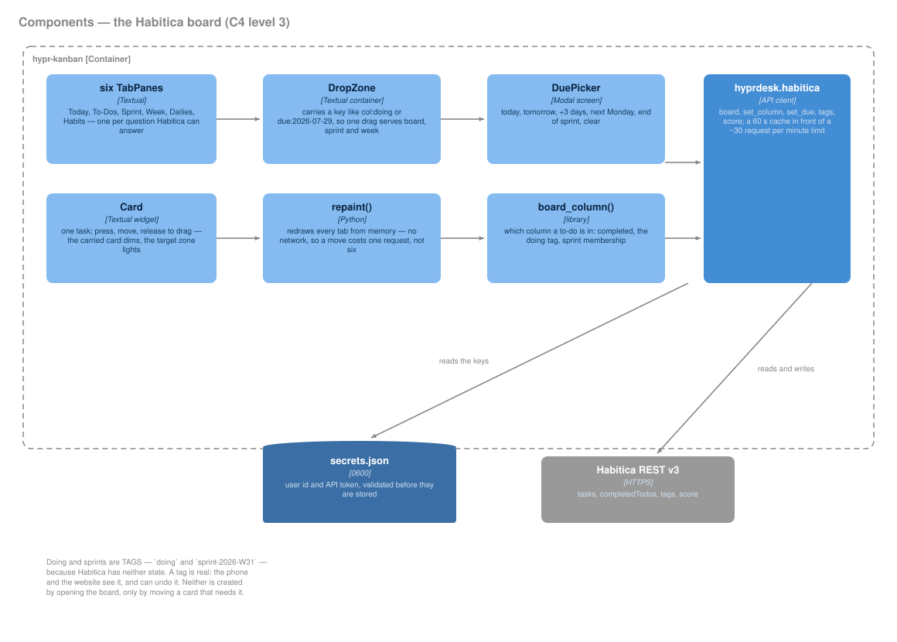

# The Habitica board

`ALT+CTRL+K`, or click the focus card. A Textual TUI over [Habitica's REST
API v3](https://habitica.com/apidoc/), in the fleet's palette.

*Generated by [`docs/diagrams/gen_c4.py`](diagrams/gen_c4.py) — edit the
declaration there, not the SVG.*

## Six tabs, because Habitica holds six questions

Habitica has four task types and none of them is a column. Squeezing them
into one board misrepresents all of them, so each gets the shape it
deserves.

| Tab | What it answers |
|---|---|
| **Today** | Overdue, due today, in progress, today's dailies |
| **To-Dos** | The plain board — To do · Doing · Done |
| **Sprint** | Backlog · To do · Doing · Done for one ISO week |
| **Week** | Seven day columns; drop a card on a day to set its due date |
| **Dailies** | Things that recur — "done" means done *today* |
| **Habits** | A ＋ / − you press; there is nothing to finish |

## The two states Habitica does not have

**Doing** and **sprint membership** are not fields in Habitica's model. The
first attempt inferred Doing from checklist progress — a to-do with some
items ticked was "started". It is a defensible reading of the data and it
was useless in practice: almost no to-do has a checklist, so Doing stayed
empty forever.

Both are now **tags**:

| Tag | Means |
|---|---|
| `doing` | the Doing column |
| `sprint-2026-W31` | in that ISO week's sprint |

A tag is real state. It syncs, the phone and the website show it, and it
can be undone from either. ISO weeks name the sprint because every date
belongs to exactly one, so no start date has to be remembered.

**Neither tag is created by opening the board** — only by moving a card
into a column that needs one. A read must not write to your account.

## Drag and drop, in a terminal

A terminal has no ghost to float under the cursor. So the drag is shown
the honest way: the card you are carrying dims, and the zone that will
take it lights up. Press, move, release — the gesture is unchanged, only
the feedback differs.

A `DropZone` carries a key — `col:doing`, `sprint:backlog`,
`due:2026-07-29` — so one drag implementation serves the board, the sprint
and the week view. `[` and `]` do the same from the keyboard, and a
**double-click** ticks a card off (a single click only focuses; ticking
something by brushing past it would be worse than not being able to).

## The request budget

Habitica allows roughly **30 requests a minute**. One refresh spends
**five**: `todos`, `completedTodos`, `dailys`, `habits`, `user`.

That shapes the whole design:

- **Actions do not refetch.** A drag moves the card, calls the API, then
  updates the local copy and redraws every tab from memory. Reloading
  after each one meant three drags in a row hit HTTP 429 — which is how
  this limit was found.
- **The poll is 2 minutes**, which costs 2.5 requests/min and leaves the
  rest for what you do. It also catches work ticked off on the phone. It
  never lands mid-drag.
- **Tags are cached** and only busted by the calls that change them.

## Two faults that made the old board look broken

1. **`GET /tasks/user?type=todos` returns only *unfinished* to-dos.**
   Ticking one made it vanish from the board rather than move to Done. The
   column was not empty because of a mapping bug — the cards were never
   fetched. `completedTodos` is fetched too now. It returns roughly the
   last 30, and the column says so rather than implying it is everything
   you have ever finished.
2. **Nothing could be ticked after switching tabs.** `1 2 3` changed the
   visible tab but left focus on a card in the old one, and TabbedContent
   activates whichever pane holds focus — so the tab snapped back and
   Enter did nothing, silently. Focus follows the visible pane now, and
   Enter with nothing selected says so.

## Credentials

`~/.config/hyprdesk/secrets.json`, mode 0600, via `hyprdesk.secrets` —
**never** `widgets.conf`, which is in this public repo. Keys are validated
against Habitica *before* being stored, so a typo fails at the point of
entry instead of silently on the board days later. Enter them in
**Hypr Settings → Integrations** (`ALT+X`); the field has a paste button,
because `Ctrl+V` belongs to the terminal emulator and never reaches a TUI.

## Files

| | |
|---|---|
| `bin/hypr-kanban` | the board |
| `lib/hyprdesk/habitica.py` | the API client, cache and column rules |
| `lib/hyprdesk/secrets.py` | the 0600 store |
